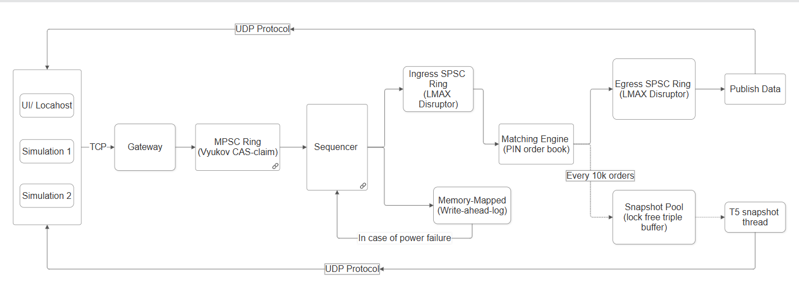

# Titan HFT v1

A limit-order matching engine and L2 market-data server in **C++20**. A single-writer, lock-free
matching core runs behind Disruptor-style rings, journals every order to a memory-mapped
write-ahead log, and publishes executions and periodic L2 snapshots over UDP multicast. *(A Python
WebSocket terminal is included for visualization.)*


- **Matching** — price-time priority; LIMIT / MARKET / IOC; partial fills and multi-level sweeps.
- **Concurrency** — a 5-thread pipeline (N gateways → MPSC ring → sequencer → matcher → publisher,
  plus a snapshot thread), with no mutex, condition variable, or futex on any hot path.
- **Persistence & recovery** — an `mmap` write-ahead log with sequence-invariant torn-tail recovery
  and deterministic replay.
- **Market data** — two UDP multicast feeds: incremental trades (`feed_seq`-tagged for gap
  detection) and periodic L2 snapshots for late-join / gap-fill.
- **Verification** — an ASan/UBSan unit suite (37 tests) plus ThreadSanitizer stress gates on every
  lock-free structure.



**Contents:** [Motivation](#motivation) · [Architecture](#1-architecture) ·
[Benchmarks & Methodology](#2-benchmarks--methodology) · [Repository](#3-repository-structure) ·
[Build](#4-build) · [Running](#5-running-the-engine--web-tui) · [Verification](#6-verification) ·
[Roadmap](#7-roadmap--limitations) · [Attribution](#attribution)

The deep dive — the per-hand-off memory-ordering model and the ThreadSanitizer stress setups —
lives in **[ARCHITECTURE.md](ARCHITECTURE.md)**.

---

## Motivation

Built to practice the disciplines behind low-latency systems work rather than to demo a feature
set: cache-aware data layout, lock-free hand-offs whose memory ordering is verified rather than
assumed, and optimization driven by measurement. Every change to the hot path is profiled before
and after; changes that did not help are kept and labelled as such rather than dropped. The intent
is a working reference for reasoning about the machine, not a toy exchange.

---

## 1. Architecture

Inbound flow crosses the wire once and is not copied to the heap again. An edge-triggered `epoll`
gateway reads raw 40-byte `Order`s; an MPSC ring fans several gateways into one Sequencer that
assigns total order and write-ahead journals each order; the Matcher crosses it against a
Priority-Indicated-Node (PIN) book; a UDP publisher broadcasts the resulting `TradeEvent`s. Every
inter-thread hand-off is lock-free — release/acquire on the rings, `seq_cst` on the snapshot
reclamation handshake.

**Invariants** (enforced by types, `static_assert`, and the sanitizer suites):

- No OS-heap allocation after startup — a PMR arena over a single startup buffer with a null
  upstream; exhaustion throws, it never calls `malloc`.
- `noexcept` hot paths that degrade rather than crash — arena/pool exhaustion (forced in the ASan
  suite with an undersized arena) emits a `REJECTED` event instead of terminating.
- Fixed-point prices only (`int64` ticks); no floating point on the order path.

### Optimization highlights

Each was profiled before and after; the full problem → design → result write-ups (and the
memory-ordering table) are in **[ARCHITECTURE.md](ARCHITECTURE.md)**.

- **Cancel-path cache locality** — a 32-byte `alignas(32)` slab entry shadows `price`/`qty`/`side`
  inline (two entries per 64-byte L1 line), so a cancel is one id-indexed load rather than a chase
  through id-slab → node → cold slot payload — gprof's dominant cost: **−20% latency / +25%
  throughput** on the cancel-heavy bench.
- **Batched socket reads** — draining 4 KB per readiness event and parsing whole `Order`s in memory
  cuts ~10⁶ syscalls to ~10³ for a million-order flow.
- **Lock-free hand-offs** — SPSC rings (release/acquire, batch-drain + prefetch), a Vyukov MPSC
  fan-in ring (CAS-claim + per-cell published sequence), and a triple-buffer snapshot pool
  (`seq_cst` reclamation) — each verified under ThreadSanitizer.

---

## 2. Benchmarks & Methodology

These are **local-development** figures from a WSL2 box on loopback — a functional baseline, not a
performance claim. WSL2 adds hypervisor scheduling and a translated network stack, so the absolute
numbers do not represent native hardware; bare-metal validation with `isolcpus` / `taskset` is
pending (see [Roadmap](#7-roadmap--limitations)). Read the within-run A/B ratios, not the peaks.

| Environment | |
|---|---|
| CPU | Intel Core i7-13620H (10 cores / 16 threads); no pinning or isolation |
| Memory · Kernel | 8 GB (WSL2 VM) · Linux 6.18 microsoft-standard-WSL2 |
| Compiler | g++ 13.3, C++20, `-O3 -march=native -DNDEBUG` |
| Transport | loopback only (no NIC); single-symbol book; single TCP client for ingest |
| Method | min-of-N repetitions; wire-to-wire via shared `CLOCK_MONOTONIC`; profiler is gprof |

| Benchmark | Workload | Result | Source |
|---|---|---|---|
| Matcher, single-thread | 5M ops, 40/55/5 add/cancel/mkt over a 1M-order book | ~163 ns/op (~6.1 M ops/s), min of 7 | `bench/matcher_bench.cpp` |
| — cancel-path opt (v1.4.10) | same, cancel-heavy, A/B | 204 → 163 ns/op (−20%), +25% | `bench/matcher_bench.cpp` |
| Pipeline egress, 3-thread | 5M orders through matcher → egress → publisher | 3rd-core overhead 60% → 7% | `bench/pipeline_bench.cpp` |
| WAL append (marginal) | sequencer publish loop, append vs no-WAL | +2.5 ns/order | `bench/pipeline_bench.cpp` |
| Ingest, front half | 1M orders, single loopback client | ~11 M orders/s (observed 9–20) | `bench_end_to_end.sh` |
| Wire-to-wire | 1M orders; first inbound byte → millionth outbound trade | ~4 M orders/s (233–310 ms) | `bench_end_to_end.sh` |
| UDP delivery | 1M trades over loopback | 0 loss / 28,108 datagrams | `bench_end_to_end.sh` |

**Reading the numbers.**

- WSL2 VM scheduling produces 30–150% run-to-run variance; the reliable signals are within-run A/B
  ratios and min-of-N, not absolute peaks.
- The **~2.5 ns WAL append** is the marginal cost of the append itself — a `memcpy` into the mapped
  page cache — and excludes the deferred `msync`; durability rides an `MS_ASYNC`/`MS_SYNC` cadence
  off the hot path.
- **0 UDP loss** is over loopback socket buffers (an IPC path, not a NIC) — it shows the receive
  path keeps pace with ~28k datagrams; hardware-NIC profiling is pending.
- There is **no latency-percentile harness yet** — these are throughput figures only. P50/P99/P99.9
  and hardware-counter attribution (IPC, LLC and branch misses) require a percentile harness and
  `perf`; both are on the roadmap. `perf` is unavailable on this WSL2 kernel, so profiling used
  gprof against the single-threaded matcher benchmark.

---

## 3. Repository Structure

```
titan-hft-v1/
├── src/
│   └── main.cpp                 titan-server: N-gateway 5-thread topology + cascading shutdown
├── include/titan/               header-only core
│   ├── domain/types.hpp         fixed-point PriceTick, ids, Side/OrderType enums
│   ├── book/
│   │   ├── order.hpp            Order POD (40 B)
│   │   ├── pin_node.hpp         PIN node: occupancy mask + intrusive FIFO (metadata-first, alignas 64)
│   │   ├── price_level.hpp      price level + O(1) top-of-book aggregates
│   │   ├── rb_price_index.hpp   intrusive neighbor-aware Red-Black price index (O(1) splice/graft)
│   │   ├── order_book.hpp       dense 32 B SlabEntry id-index + RB index + PIN node pool
│   │   ├── matcher.hpp          price-time matcher (LIMIT/MARKET/IOC), noexcept, sink-templated
│   │   ├── trade_event.hpp      TradeEvent POD (40 B) with feed_seq
│   │   └── snapshot.hpp         L2 snapshot structs + lock-free triple-buffer SnapshotPool
│   ├── memory/arena.hpp         PMR arena (monotonic + pool, null upstream)
│   ├── pipeline/
│   │   ├── spsc_ring.hpp        generic SPSC Disruptor ring (batch-drain + prefetch)
│   │   ├── ingress_ring.hpp     IngressRing = SpscRing<Order>
│   │   ├── egress_ring.hpp      EgressRing  = SpscRing<TradeEvent>
│   │   ├── mpsc_ring.hpp        Vyukov MPSC fan-in ring (CAS-claim + per-cell sequence)
│   │   └── sequencer.hpp        stamp seq → WAL → ingress; run() drain loop + recovery replay
│   ├── io/journaler.hpp         mmap write-ahead log + ABI tripwire + durability cadence
│   └── net/
│       ├── tcp_gateway.hpp      edge-triggered epoll gateway (batched recv, TCP_NODELAY)
│       └── udp_publisher.hpp    non-blocking UDP multicast, MTU-safe chunking
├── tests/                       ASan/UBSan unit suite, TSan ring/pool gates, blaster + harness
├── bench/                       single-thread matcher + multi-thread pipeline microbenchmarks
├── ui/                          Python trading terminal
│   ├── app.py                   FastAPI/uvicorn: UDP feeds → WebSocket + binary order proxy
│   ├── fake_bot.py              mock market + bots + mock gateway (stdlib-only smoke test)
│   └── index.html               dark Web-TUI: book, tape, OHLCV candles, risk desk, order entry
├── build.sh  server.sh  tsan.sh  bench.sh  pipeline.sh  bench_end_to_end.sh  profile.sh
├── ARCHITECTURE.md              memory-ordering model, TSan setups, component deep-dive
└── Architecture.png
```

---

## 4. Build

Toolchain: g++ 13, C++20, Linux / WSL2, `-pthread`. The core is header-only; the scripts drive
`g++` directly (a `CMakeLists.txt` stub is present but not the canonical build).

```bash
bash server.sh     # production engine, RELEASE (-O3 -march=native), frame pointers kept -> build/titan-server
bash build.sh      # full unit suite under AddressSanitizer + UndefinedBehaviorSanitizer
```

---

## 5. Running the Engine & Web-TUI

```bash
# 1) build the engine
bash server.sh

# 2) Python UI dependencies (one-time)
python3 -m venv ui/.venv
ui/.venv/bin/pip install fastapi "uvicorn[standard]" websockets

# 3) launch the UI gateway -> http://127.0.0.1:8080
#    (joins the UDP feeds; proxies manual orders to the engine gateway over TCP :9099)
ui/.venv/bin/python ui/app.py

# 4a) drive it with the mock market (no C++ engine required):
python3 ui/fake_bot.py

# 4b) ...or with the real engine (the UI's order proxy targets :9099):
./build/titan-server 9099
```

The terminal shows the L2 book, the trade tape, a 1-second OHLCV candlestick chart, a bot risk
desk, and a manual order-entry panel that round-trips a binary `Order` through the Python proxy
into the engine's gateway.

---

## 6. Verification

Correctness is gated by sanitizers, not inspection. ASan and TSan are mutually exclusive, so they
are separate targets.

| Gate | Tool | Scope | Result |
|---|---|---|---|
| `build.sh` | ASan + UBSan | book, matcher, RB tree, WAL, sequencer, gateway, snapshot | 37 tests / 67,474 checks / 0 failures |
| `tsan.sh` (SPSC) | ThreadSanitizer | 1P/1C, 5M items, 1024-slot ring | 0 data races |
| `tsan.sh` (MPSC) | ThreadSanitizer | 4P/1C, 1M items | 0 races, exactly-once (0 loss/dup/torn) |
| `tsan.sh` (Snapshot) | ThreadSanitizer | 1W/1R triple-buffer, 1M generations | 0 races, 0 torn reads |

```bash
bash build.sh              # ASan / UBSan
bash tsan.sh               # ThreadSanitizer gates (runs under setarch -R to disable ASLR on WSL2)
bash bench_end_to_end.sh   # 1,000,000-order TCP blaster, wire-to-wire timing (needs python3)
```

ThreadSanitizer is a dynamic detector: these runs verify the exercised stress paths are race-free,
which is strong evidence but not a proof of total correctness.

---

## 7. Roadmap & Limitations

The current ceiling is the operating system and runtime environment, not the engine: the profiled
hot paths are memory-bound and fast, while the wire-to-wire tail and the run-to-run variance come
from the kernel network stack, per-packet syscall overhead, and (under WSL2) VM scheduling.

Known limitations: single symbol; loopback only (no NIC); throughput measured, no latency
percentiles; profiled with gprof, not `perf`. The natural next steps remove those OS-level limits:

- **Kernel-bypass networking** — replace `epoll`/`sendto` with **DPDK** or **`io_uring` / AF_XDP** to
  take the kernel stack and per-packet syscall off the ingress and egress paths.
- **Core pinning & isolation** — pin the pipeline threads with **`taskset` / `isolcpus`** (NUMA-aware)
  to remove scheduler migration and VM jitter, making true tail-latency percentiles measurable.
- **Schema-defined wire protocol** — the feeds and gateway move raw host-native structs (fast, but
  ABI-fragile across architectures and versions); **Simple Binary Encoding (SBE)** adds versioned,
  forward/backward-compatible zero-copy messaging.

Further out: hugepages for the arena and WAL, hardware NIC timestamping for honest latency
measurement, a `perf`/flamegraph and P50/P99 percentile harness, and multi-symbol sharding.

---

## Attribution

The SPSC ring adapts the **LMAX Disruptor**; the MPSC ring implements **Dmitry Vyukov's** bounded
lock-free queue. The PIN order book, neighbor-aware Red-Black price index, 32-byte dense-slab id
index, PMR arena, `mmap` WAL with sequence-invariant recovery, the dual-feed market-data plane, and
the end-to-end pipeline are original implementations; borrowed algorithms are named where used.

*Full design rationale: [ARCHITECTURE.md](ARCHITECTURE.md). Current version: v1.5.0.*
