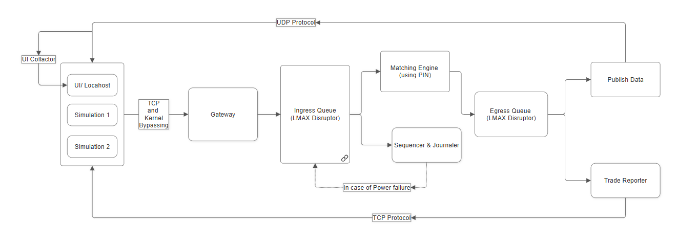

# Titan HFT v1

A lock-free, zero-allocation limit-order matching engine and L2 market-data server written in
**C++20**, paired with a real-time **WebSocket / FastAPI** Python trading terminal. Built as a
study in mechanical sympathy: the engine is treated as a cache and coherence machine, not an
instruction machine, and every design choice targets the memory hierarchy and the cross-core
protocol rather than the arithmetic.



---

## 1. Architecture & Overview

Order flow crosses the wire once and is never copied onto the heap again. A raw 40-byte `Order`
is read off a TCP socket by an edge-triggered `epoll` gateway, fanned through a lock-free ring
into a single Sequencer that assigns total order and write-ahead journals it, matched against a
Priority-Indicated-Node (PIN) book, and broadcast as raw binary on two UDP multicast channels.
There is **no mutex, condition variable, or kernel futex on any hot path** — every inter-thread
hand-off is a hand-rolled lock-free structure whose memory ordering is verified race-free by
ThreadSanitizer.

The design is governed by a small set of non-negotiable invariants: **zero OS-heap allocation
after startup** (a PMR arena over one startup buffer with a null upstream — exhaustion throws, it
never `malloc`s), **`noexcept` hot paths that degrade rather than crash** under resource
exhaustion, and **fixed-point prices only** (`int64` ticks; no floating point on the order path).

Mechanical-sympathy highlights:

- **Vyukov MPSC fan-in ring** — multiple network gateways feed one Sequencer through a bounded
  lock-free ring: a `compare_exchange_weak` CAS claims a slot, a per-cell published-sequence word
  (release/acquire) signals completion, so the single consumer never observes a torn or
  out-of-order producer write.
- **32-byte cache-aligned `SlabEntry`** — the id→location slab shadows `price`, `remaining`, and
  `side` inline (`alignas(32)`), so a cancel is satisfied from one cache line of pure id-indexed
  arithmetic instead of chasing id-slab → PIN node → cold slot payload. Profiling attributed ~60%
  of engine time to that indirection; the refactor removed the cold cache-line load entirely.
- **POSIX `mmap` write-ahead log** — `append()` is a `memcpy` into the mapped page cache plus a
  cursor bump (no syscall on the per-order path); durability is deferred to an `MS_ASYNC`/`MS_SYNC`
  cadence off the critical path, and torn-tail recovery enforces a monotonic sequence invariant
  rather than a fragile zero-sentinel.
- **UDP multicast without IP fragmentation** — datagrams are chunked to stay under the Ethernet
  MTU (1440-byte budget), because a single lost fragment discards an entire datagram.

For the full memory-ordering model, the per-hand-off release/acquire vs. `seq_cst` reasoning, and
the ThreadSanitizer proofs, see **[ARCHITECTURE.md](ARCHITECTURE.md)**.

---

## 2. Core System Capabilities & Metrics

- **~11M orders/sec ingest** (front half: TCP → gateway → MPSC → Sequencer → ingress ring), i.e.
  ~90 ns amortized per order, paced by TCP flow control.
- **~4M orders/sec end-to-end**, wire-to-wire, measured from the first inbound TCP byte to an
  external listener receiving the 1,000,000th outbound trade.
- **Wait-free L2 snapshot publication** — the Matcher serializes a consistent top-of-book image
  into a lock-free triple-buffer pool and hands it off via `seq_cst` hazard flags without ever
  blocking; a dedicated thread multicasts it, isolating the fat periodic snapshot from the
  latency-critical trade feed.
- **Dual-feed UDP multicast market data** — an incremental `TradeEvent` feed (40 B, `feed_seq`
  tagged for gap detection) and a periodic L2 snapshot feed for late-join / gap-fill.
- **Zero-crash under exhaustion** — arena/pool exhaustion degrades to a `REJECTED` event, never
  `std::terminate`; verified in the ASan/UBSan suite.
- **~2.5 ns write-ahead-log append**, syscall-free; **0 UDP loss** delivering 1M trades on loopback.
- **Profiling-driven optimization** — the cache-locality refactor cut the cancel path **−20%
  latency / +25% throughput** on a cancel-heavy workload.

> Measurement environment: WSL2 (Ubuntu, g++ 13), `-O3 -march=native`, loopback, single symbol, no
> core pinning. Absolute figures carry 30–150% run-to-run variance from VM scheduling/thermal; the
> load-bearing signals are the within-run A/B ratios. These are indicative, not bare-metal numbers.

---

## 3. Repository Structure

```
titan-hft-v1/
├── src/
│   └── main.cpp                     titan-server: N-gateway 5-thread topology, cascading shutdown
├── include/titan/                   header-only core
│   ├── domain/types.hpp             fixed-point PriceTick, ids, Side/OrderType enums
│   ├── book/
│   │   ├── order.hpp                Order POD (40 B)
│   │   ├── pin_node.hpp             PIN node: occupancy mask + intrusive FIFO (metadata-first, alignas 64)
│   │   ├── price_level.hpp          price level + O(1) top-of-book aggregates
│   │   ├── rb_price_index.hpp       intrusive neighbor-aware Red-Black price index (O(1) splice/graft)
│   │   ├── order_book.hpp           dense 32 B SlabEntry id-index + RB index + PIN node pool
│   │   ├── matcher.hpp              price-time matcher (LIMIT/MARKET/IOC), noexcept, sink-templated
│   │   ├── trade_event.hpp          TradeEvent POD (40 B) with feed_seq
│   │   └── snapshot.hpp             L2 snapshot structs + lock-free triple-buffer SnapshotPool
│   ├── memory/arena.hpp             PMR arena (monotonic + pool, null upstream)
│   ├── pipeline/
│   │   ├── spsc_ring.hpp            generic SPSC Disruptor ring (batch-drain + prefetch, batch-publish)
│   │   ├── ingress_ring.hpp         IngressRing = SpscRing<Order>
│   │   ├── egress_ring.hpp          EgressRing  = SpscRing<TradeEvent>
│   │   ├── mpsc_ring.hpp            Vyukov MPSC fan-in ring (CAS-claim + per-cell sequence)
│   │   └── sequencer.hpp            seq stamp → WAL → ingress; run() drain loop + recovery replay
│   ├── io/journaler.hpp             mmap write-ahead log + ABI tripwire + durability cadence
│   └── net/
│       ├── tcp_gateway.hpp          edge-triggered epoll gateway (batched recv, TCP_NODELAY)
│       └── udp_publisher.hpp        non-blocking UDP multicast, MTU-safe chunking
├── tests/
│   ├── tests.cpp ut.hpp matcher_tests.cpp rb_tree_tests.cpp journaler_tests.cpp
│   │                                sequencer_tests.cpp tcp_gateway_tests.cpp     (ASan/UBSan suite)
│   ├── spsc_ring_tests.cpp mpsc_ring_tests.cpp snapshot_tests.cpp                 (ThreadSanitizer gates)
│   ├── tcp_blaster.cpp              1M-order wire-to-wire benchmark client
│   └── mc_listener.py multicast_test.sh                                          (multicast verification)
├── bench/
│   ├── matcher_bench.cpp            single-thread matcher throughput
│   └── pipeline_bench.cpp           inline / 2-thread / 3-thread pipeline + journaling-tax
├── ui/                              Python trading terminal
│   ├── app.py                       FastAPI/uvicorn: UDP feeds → WebSocket + binary order proxy
│   ├── fake_bot.py                  mock market + bots + mock gateway (UI smoke test, stdlib only)
│   └── index.html                  dark monospace Web-TUI: book, tape, OHLCV candles, risk desk, order entry
├── build.sh  server.sh  tsan.sh  bench.sh  pipeline.sh  bench_end_to_end.sh  profile.sh
├── ARCHITECTURE.md                  memory-ordering model, TSan proofs, component deep-dive
├── HANDOFF.md  PROGRESS.md
└── docs/architecture.png
```

`CMakeLists.txt` is present as a foundation-phase stub; the canonical build is the bash scripts below.

---

## 4. Build

Toolchain: **g++ 13, C++20, Linux / WSL2** (`-pthread`). The core is header-only; the scripts drive
`g++` directly.

```bash
# Production engine — RELEASE (-O3 -march=native -DNDEBUG), frame pointers kept for perf.
bash server.sh            # -> build/titan-server

# Full unit suite — AddressSanitizer + UndefinedBehaviorSanitizer (the zero-crash proof).
bash build.sh             # 37 tests / 67,474 checks
```

---

## 5. Running the Engine & Web-TUI — Quick Start

```bash
# 1) Build the engine.
bash server.sh

# 2) Python UI dependencies (one-time).
python3 -m venv ui/.venv
ui/.venv/bin/pip install fastapi "uvicorn[standard]" websockets

# 3) Launch the UI gateway  ->  http://127.0.0.1:8080
#    (joins the UDP multicast feeds, proxies manual orders to the engine over TCP :9099)
ui/.venv/bin/python ui/app.py

# 4a) Verify the terminal with the mock market (no C++ engine required):
python3 ui/fake_bot.py

# 4b) ...or drive it with the real engine. The UI's order proxy targets :9099,
#     so launch titan-server on that port:
./build/titan-server 9099
```

Open `http://127.0.0.1:8080`: the L2 book (bids/asks with depth), the trade tape, a 1-second OHLCV
candlestick chart, the bot risk desk, and a manual order-entry panel that round-trips a binary
`Order` through the Python proxy into the engine's gateway.

---

## 6. Verification & Benchmarks

```bash
# Concurrency proofs — ThreadSanitizer gates (mutually exclusive with ASan, so a separate target):
bash tsan.sh
#   SPSC ring : 1P/1C, 5M items, 1024-slot ring          -> 0 data races
#   MPSC ring : 4P/1C, 1M items                           -> 0 races, exactly-once (0 loss/dup/torn)
#   Snapshot  : 1W/1R triple-buffer, 1M generations       -> 0 races, 0 torn reads

# Memory-safety + logic — AddressSanitizer / UndefinedBehaviorSanitizer:
bash build.sh                     # 37 tests / 67,474 checks / 0 failures

# Wire-to-wire baseline — 1,000,000-order TCP blaster, measured over shared CLOCK_MONOTONIC:
bash bench_end_to_end.sh          # requires python3; reports ingest and full-delivery rates

# Single-thread matcher + multi-thread pipeline microbenchmarks:
bash bench.sh                     # matcher throughput (min-of-N, thermal-invariant ratios)
bash pipeline.sh                  # inline / 2-thread / 3-thread + journaling-tax
```

Note (WSL2): `tsan.sh` runs under `setarch -R` to disable ASLR, working around a Microsoft-kernel
ThreadSanitizer "unexpected memory mapping" fatal.

---

*See [ARCHITECTURE.md](ARCHITECTURE.md) for the deep dive. Current version: v1.5.0.*
